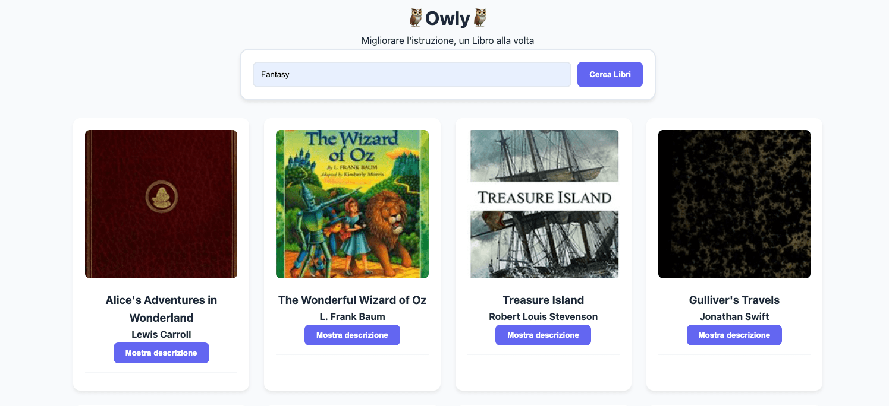

# 🦉 Owly - EdTech SaaS Platform


**Owly** is a professional web application prototype designed for the primary education sector. Developed as a **SaaS (Software as a Service)** solution, it aims to support teachers and students through an intuitive interface.

## 🌐 Live Demo
You can explore the live application here:  
👉 [**Owly App - Live on Vercel**](https://owly-app.vercel.app/)

---

## 📸 Preview



---

## 🛠️ Tech Stack & Tooling


This project leverages modern frontend development tools:

- **Build Tool**: [Vite](https://vitejs.dev/) — For fast development and optimized production bundling.
- **Core Logic**: Vanilla JavaScript (ES6+ Modules).
- **Styling**: Modular CSS architecture using the `@import` strategy.
- **Data Handling**: **Axios** for API requests and **Lodash** for data navigation.
- **API**: [Open Library Search API](https://openlibrary.org/developers/api).

---

## 📂 Project Structure

```

Owly-App/
├── public/                      # Asset statici (non processati da Vite)
│   └── og-image.png             # Immagine anteprima Open Graph (1200x630px)
├── src/
│   ├── css/                     # Directory dei fogli di stile modulari
│   │   ├── global.css           # Punto di ingresso principale (@import)
│   │   ├── variables.css        # Design tokens: colori e font
│   │   ├── layout.css           # Stili strutturali: grid e search bar
│   │   ├── components.css       # Elementi UI: card dei libri e bottoni
│   │   ├── animations.css       # Spinner ed effetti skeleton
│   │   └── responsive.css       # Media queries per mobile/tablet
│   └── js/                      # Logica dell'applicazione
│       ├── api.js               # Service layer per API (Axios + Lodash)
│       ├── ui.js                # Rendering del DOM e aggiornamenti UI
│       ├── main.js              # Orchestratore dell'applicazione
│       └── tests/               # Unit Testing
│           └── books.test.js    # Test automatici con Vitest
├── index.html                   # Entry point (SEO & tag Open Graph)
├── package.json                 # Dipendenze del progetto e script (npm test)
├── vite.config.js               # Configurazione di Vite
└── README.md                    # Documentazione del progetto

```

## ⚙️ Installation & Local Development

To run this project locally, follow these steps:

1. **Clone the repository:**

```bash
git clone https://github.com/your-username/owly-edtech-app.git
```

2. **Install dependencies:**

```bash
npm install
```

3. **Start the development server:**

```bash
npm run dev
```

4. **Build for production:**

```bash
npm run build
```

---
## 🛡️ Error Handling & Resilience

The application is built to handle common external API challenges gracefully:

* **User Feedback:** If a search yields no results, the user is notified with a clear message: *"No books found. Try another category."*
* **Graceful Degradation:** If a book description is missing from the Open Library API, the system displays a polite fallback message instead of a technical error or an empty field.
* **Loading States:** During asynchronous calls, **Skeleton Loaders** and **Spinners** are utilized to keep the user informed, preventing the "frozen app" experience.
* **Smart Caching:** Previously fetched descriptions are cached locally per session to reduce API overhead and significantly improve response times.

---

## 📖 Corporate Vision: Owly

Following the mission of Team Owly, this platform is designed to be:

- **Accessible**: High-contrast UI for diverse learning needs.
- **Inclusive**: Ready for future integrations like LIS (Italian Sign Language).
- **Interactive**: Transforming book searches into dynamic learning tools.

---

## 📩 Contact

- 💼 GitHub: **https://github.com/gcangemi1997-coder**  
- 📧 Email: `g.cangemi1997@gmail.com`  
- 🌐 Portfolio / personal website link here 👉 https://gcangemi1997-coder.github.io/

> Feel free to reach out if you want to talk about web development, learning paths, or new project ideas.

**Team Owly** — Innovating primary education through technology.
